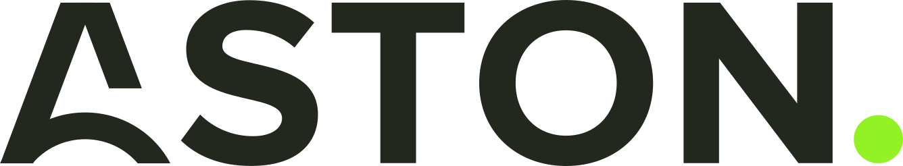
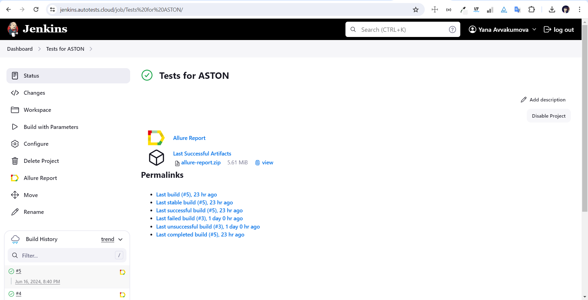
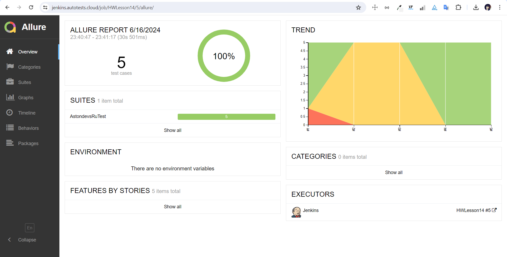
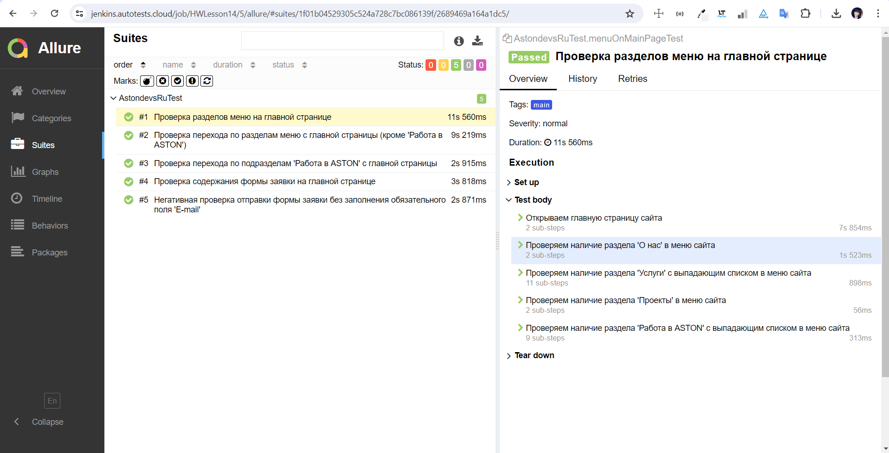
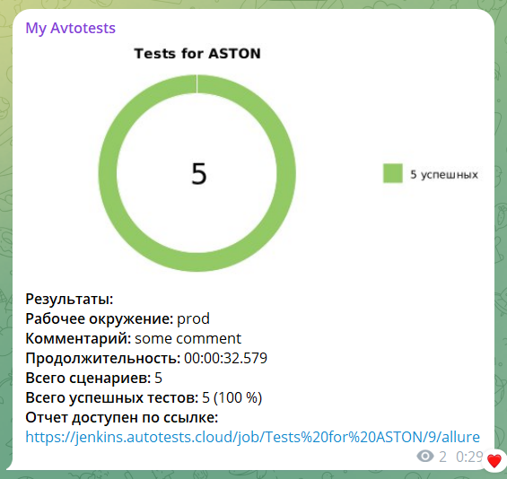


# Проект по автоматизации тестирования для компании [ASTON](https://astondevs.ru/)  
<div style="text-align: center">
  <div style="display: inline-block">
    <a href="https://astondevs.ru/">
      
    </a>
  </div>
</div>

**ASTON** — российская аккредитованная ИТ-компания, четырехкратный обладатель премии «Работодатель года» по версии Habr (2019, 2020, 2021, 2022 гг.). C 2007 года разрабатываем цифровые решения для b2b-клиентов.

## **Содержание:**

* <a href="#tools">Технологии и инструменты</a>

* <a href="#cases">Примеры автоматизированных тест-кейсов</a>

* <a href="#jenkins">Сборка в Jenkins</a>

* <a href="#console">Запуск из терминала</a>

* <a href="#allure">Отчет в Allure</a>

* <a href="#telegram">Уведомление в Telegram</a>

* <a href="#video">Выполнение тестов на Selenoid</a>

<a id="tools"></a>
## **Технологии и инструменты:**

<p align="center">  
<a href="https://www.jetbrains.com/idea/"></a>  
<a href="https://www.java.com/"></a>  
<a href="https://github.com/"></a>  
<a href="https://junit.org/junit5/"></a>  
<a href="https://gradle.org/"></a>  
<a href="https://selenide.org/"></a>  
<a href="https://aerokube.com/selenoid/"></a>  
<a href="ht[images](images)tps://github.com/allure-framework/allure2"></a>
<a href="https://www.jenkins.io/"></a>   
</p>

<a id="cases"></a>
## **Примеры автоматизированных тест-кейсов:**

- *Проверка разделов меню на главной странице*
- *Проверка перехода по разделам меню с главной страницы*
- *Проверка перехода по подразделам 'Работа в ASTON' с главной страницы*
- *Проверка содержания формы заявки на главной странице*
- *Негативная проверка отправки формы заявки без заполнения обязательного поля 'E-mail'*

<a id="jenkins"></a>
## **Сборка в [Jenkins](https://jenkins.autotests.cloud/job/Tests%20for%20ASTON/)**
<p align="center">  
<a href="https://jenkins.autotests.cloud/job/Tests%20for%20ASTON/"></a>  
</p>

### Параметры сборки в Jenkins:

- *BROWSER (браузер, по умолчанию chrome)*
- *BROWSER_VERSION (версия браузера, по умолчанию 122.0)*
- *BROWSER_SIZE (размер окна браузера, по умолчанию 1920x1080)*
- *WDHOST (логин, пароль и адрес удаленного сервера Selenoid)*

<a id="console"></a>
### Команды для запуска из терминала
***Локальный запуск:***
```bash  
clean zentist_test
```

***Удалённый запуск через Jenkins:***
```bash  
clean zentist_test
"-DWdhost=${WDHOST}" 
"-DBrowser=${BROWSER}" 
"-DBrowserVersion=${BROWSER_VERSION}" 
"-DBrowserSize=${BROWSER_SIZE}"
```

<a id="allure"></a>
## Отчет в [Allure](https://jenkins.autotests.cloud/job/Tests%20for%20ASTON/5/allure/)
<p align="center">  
<a href="https://jenkins.autotests.cloud/job/Tests%20for%20ASTON/5/allure/"></a>  
</p>
<p align="center">  
<a href="https://jenkins.autotests.cloud/job/Tests%20for%20ASTON/5/allure/"></a>  
</p>

<a id="telegram"></a>
## Уведомление в Telegram
<p align="center">  
  
</p>

<a id="video"></a>
## Выполнение тестов на Selenoid
<p align="center">  
  
</p>
